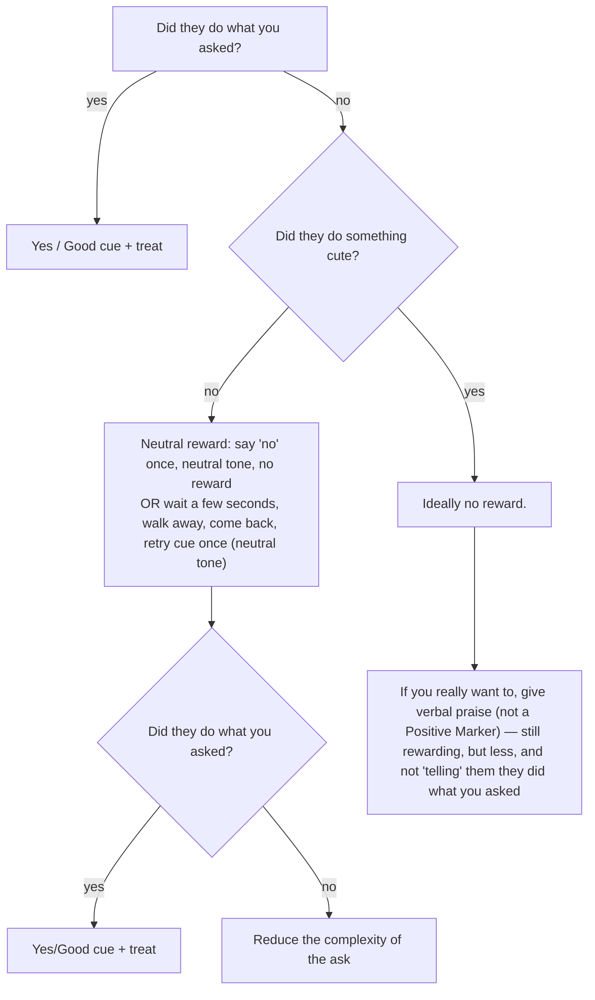

import Card from "../../../components/Card.astro";

<Card>
## Be consistent

Use the same markers everytime. It is boring for you, but makes it clear to the dog what you are asking for.

### Keep treats on you on walks

Add random cues at random intervals on your walks. This keeps them on their toes!

## Reward flow chart

</Card>
